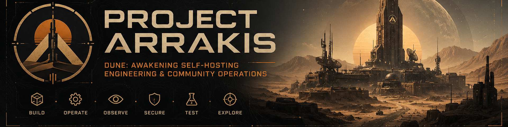

<!--
Project Arrakis GitHub organization profile
Repository: Project-Arrakis/.github
Path: profile/README.md

Banner asset:
profile/assets/project-arrakis-banner.png
-->

  

**Platform · Observability · Automation · Security · Infrastructure · Community**

*Infrastructure for those who choose to operate Arrakis themselves.*

 

 

[**🐳 Run a Server**](https://github.com/Project-Arrakis/dune-awakening-selfhost-docker)
  •  
[**🧭 Explore Projects**](https://github.com/orgs/Project-Arrakis/repositories)
  •  
[**💬 Discussions**](https://github.com/Project-Arrakis/dune-awakening-selfhost-docker/discussions)
  •  
[**🐛 Issues**](https://github.com/Project-Arrakis/dune-awakening-selfhost-docker/issues)

---

## 🏜️ What is Project Arrakis?

**Project Arrakis** is an open-source engineering and community ecosystem built around self-hosted **Dune: Awakening** environments.

We focus on the systems required to **deploy, operate, observe, automate, secure, test, and maintain** self-hosted game infrastructure while also supporting the community that plays on it.

Our work spans two complementary areas:

* ⚙️ **Engineering** — self-hosting, observability, automation, security, infrastructure, testing, and operational tooling.
* 🎮 **Community Operations** — construction, resource gathering, organized expeditions, and coordinated end-game activities.

> **Deploy reliably. Observe everything. Automate carefully. Explore Arrakis together.**

---

## 🧭 Project Ecosystem

Project Arrakis is organized around complementary projects covering the operational lifecycle of a Dune: Awakening environment.

| Project                                         | Role                                                                       |
| ----------------------------------------------- | -------------------------------------------------------------------------- |
| 🐳 **Dune: Awakening Docker**                   | Core self-hosting platform and containerized server infrastructure         |
| 📊 **Dune: Awakening Docker Ops Observability** | Read-only health, readiness, operational telemetry, and NOC/SOC visibility |
| 📦 **Dune: Awakening Docker Addons**            | Governed community extension and addon ecosystem                           |
| 🛡️ **Dune: Awakening Docker — Sentinel**       | Discord-facing operations, monitoring, notifications, and automation       |
| 🗺️ **Deployment Engineering**                  | Infrastructure architecture, validation, scaling, and production hardening |

### 🐳 Dune: Awakening Docker

**Core self-hosting platform and containerized server infrastructure.**

Dune: Awakening Docker provides guided deployment, browser-based administration, service lifecycle management, backups, updates, player operations, map management, diagnostics, and supporting database tooling.

Project Arrakis builds on the upstream **Dune: Awakening Self-Hosted Docker** project led and maintained by **RedBlink**. The Project Arrakis fork supports integration, testing, contribution development, and the broader Project Arrakis ecosystem.

**Focus:** `Docker` · `Linux` · `Server Management` · `Networking` · `Automation`

* **Project Arrakis:** [Project-Arrakis/dune-awakening-selfhost-docker](https://github.com/Project-Arrakis/dune-awakening-selfhost-docker)
* **Upstream:** [Red-Blink/dune-awakening-selfhost-docker](https://github.com/Red-Blink/dune-awakening-selfhost-docker)

### 📊 Dune: Awakening Docker Ops Observability

**Read-only operational visibility for Arrakis.**

Ops Observability provides health and readiness views, operational telemetry, NOC/SOC capabilities, resource visibility, and optional Prometheus/Grafana integration while remaining within its defined read-only operations boundary.

The project distinguishes between data that is **available, conditionally available, unavailable, or intentionally out of scope** rather than implying telemetry exists when the underlying platform cannot provide it.

**Focus:** `Prometheus` · `Grafana` · `SRE` · `NOC` · `SOC` · `Telemetry`

[**Explore Ops Observability →**](https://github.com/yacketrj/dune-ops-observability-addon)

### 📦 Dune: Awakening Docker Addons

**A governed extension ecosystem for Dune: Awakening Docker.**

The addon catalog provides a structured mechanism for discovering and managing community extensions while maintaining compatibility, lifecycle governance, maintainer ownership, and supply-chain awareness.

**Lifecycle:** `Active` · `Deprecated` · `Unsupported` · `Removed` · `Blocked`

**Focus:** `Extensions` · `Governance` · `Compatibility` · `Supply Chain`

[**Browse Docker Addons →**](https://github.com/yacketrj/dune-docker-addons)

### 🛡️ Dune: Awakening Docker — Sentinel

**Operational awareness and automation for the Project Arrakis ecosystem.**

Sentinel is the evolving operations companion for Dune: Awakening Docker. Its public-facing capabilities center on Discord-based server visibility and operator/community workflows, including server health and player-facing information under a read-only-by-default model.

The broader Sentinel product direction includes monitoring, notifications, operational automation, upstream awareness, and controlled administrative workflows.

**Sentinel Web** is the companion web interface for operational visibility, telemetry, diagnostics, and administration.

**Focus:** `Discord` · `Operations` · `Monitoring` · `Automation` · `SRE`

> **Brand migration:** Sentinel succeeds the **Arrakis Control Panel / ACP** identity. Public repositories, documentation, and visual assets are being standardized around the Sentinel product family.

### 🗺️ Deployment Engineering

**Reference architecture and infrastructure guidance for operating Arrakis reliably.**

Deployment Engineering focuses on the infrastructure beneath the application stack, including virtualization, host architecture, networking, capacity planning, storage, security hardening, observability, scaling, backup, recovery, and production-readiness validation.

**Focus:** `Proxmox` · `Linux` · `Networking` · `Virtualization` · `Scaling` · `Security`

[**Explore Deployment Engineering →**](https://github.com/yacketrj/r740-dune-deployment-kit)

---

## ⚙️ The Arrakis Stack

| Layer                       | Capability                                                                |
| --------------------------- | ------------------------------------------------------------------------- |
| 🏜️ **Game Infrastructure** | Dune: Awakening self-hosted services                                      |
| 🐳 **Runtime**              | Docker, Docker Compose, Linux                                             |
| 🎛️ **Administration**      | Browser administration and service lifecycle management                   |
| 🛡️ **Sentinel**            | Discord integration, monitoring, notifications, and operational workflows |
| 📊 **Observability**        | Health, readiness, Prometheus, Grafana, and NOC/SOC visibility            |
| 🌐 **Networking**           | Segmentation, firewalling, service exposure, and remote administration    |
| 🔐 **Security**             | Least privilege, trust boundaries, and secure delivery controls           |
| 🧪 **Quality**              | Regression, integration, compatibility, and failure-path testing          |
| 📦 **Extensions**           | Governed community addon ecosystem                                        |
| 🗄️ **Data**                | PostgreSQL, backup, recovery, and supporting tooling                      |
| 🖥️ **Infrastructure**      | Bare metal, virtualization, Proxmox, and Linux                            |
| 📚 **Governance**           | Release validation, lifecycle controls, and operational evidence          |

---

## 🎮 Community In-Game Services

The engineering ecosystem keeps Arrakis running. **The community services help players thrive on it.**

Project Arrakis supports organized activities for players, groups, guilds, and communities across Dune: Awakening.

| Service                                  | What We Do                                                                                                |
| ---------------------------------------- | --------------------------------------------------------------------------------------------------------- |
| 🏗️ **Base Construction**                | Planning, construction, expansion, production layouts, storage, water, power, and logistics               |
| ⛏️ **Resource Farming**                  | Coordinated gathering, salvage, materials, spice operations, stockpiles, and transport                    |
| 🧭 **Overmap Dungeon Runs**              | Organized group expeditions, combat support, objectives, loot recovery, and progression                   |
| 🏜️ **Deep Desert Testing Station Runs** | Coordinated Imperial Testing Station operations, clearing, extraction, transport, and PvP-aware logistics |

### 🏗️ Base Construction

Planning and construction support for functional player and community bases, including expansion, production areas, storage organization, fabrication and refinery layouts, water and power infrastructure, vehicle support, and logistics-oriented redesigns.

### ⛏️ Resource Farming

Coordinated gathering and logistics for materials used in construction, crafting, equipment progression, vehicles, and community projects, including ore, salvage, water, spice-related resources, bulk stockpiles, and transport support.

### 🧭 Overmap Dungeon Runs

Organized group expeditions for Overmap dungeons and other cooperative expedition content, including group formation, route planning, combat support, objective completion, clearing, loot recovery, and progression assistance.

### 🏜️ Deep Desert Testing Station Runs

Coordinated Deep Desert expeditions focused on Imperial Testing Stations and other high-value objectives, including route planning, station identification, PvE clearing, PvP-aware operations where applicable, loot extraction, vehicle support, and safe-return planning.

### Need help on Arrakis?

[**💬 Organize an Activity in Discussions**](https://github.com/Project-Arrakis/dune-awakening-selfhost-docker/discussions)

---

## 🧭 Engineering Principles

Project Arrakis applies production-engineering practices to self-hosted game infrastructure without introducing unnecessary operational complexity.

* 🛡️ **Secure by default** — security controls should be designed into the platform rather than relying entirely on operator memory or perfect configuration.
* 🔐 **Least privilege** — users, services, addons, bots, integrations, and automation should receive only the access required to perform their intended function.
* 📊 **Observable systems** — operational state should be measurable and visible so degradation can be identified before it becomes an outage.
* 🧪 **Test failure paths** — regression, compatibility, recovery, rollback, and failure conditions deserve explicit validation.
* 🔁 **Reproducible operations** — deployment, upgrades, validation, backup, recovery, and rollback should be repeatable and documented.
* 🔄 **Design for recovery** — systems should help operators identify, contain, and recover from failures safely.

> `RUNNING ≠ HEALTHY ≠ READY ≠ FUNCTIONAL`

A running process does not necessarily mean a working service.

---

## 🛡️ Security & Quality

Security and quality are engineering requirements across the Project Arrakis ecosystem.

Depending on the project and its risk profile, controls may include:

* Least-privilege permission models
* Explicit trust boundaries
* Secret scanning
* Static application security testing
* Dependency and filesystem scanning
* CI validation
* Regression and integration testing
* Compatibility testing
* Upgrade and rollback validation
* Failure-path testing
* Release evidence

Security-sensitive issues should **not** be disclosed publicly before maintainers have an opportunity to assess them. Use the security-reporting mechanism documented by the affected repository where available.

---

## 🤝 Get Involved

Project Arrakis welcomes useful engineering contributions, testing, documentation improvements, bug reports, operational feedback, and community participation.

### 🐳 Run Dune: Awakening Docker

Start with the core self-hosting platform:

[**Project-Arrakis/dune-awakening-selfhost-docker →**](https://github.com/Project-Arrakis/dune-awakening-selfhost-docker)

### 🧭 Explore the Ecosystem

Browse the organization's public repositories:

[**Project Arrakis Repositories →**](https://github.com/orgs/Project-Arrakis/repositories)

### 🐛 Report a Problem

Open an issue in the repository responsible for the affected component.

For the core platform:

[**Dune: Awakening Docker Issues →**](https://github.com/Project-Arrakis/dune-awakening-selfhost-docker/issues)

A useful technical report includes the environment, relevant versions, reproduction steps, expected behavior, actual behavior, and sanitized logs where possible.

> **Never publish passwords, API keys, tokens, authentication material, personal information, or other secrets.**

### 💡 Discuss an Idea

Use GitHub Discussions for questions, ideas, operational discussions, and community coordination:

[**Project Discussions →**](https://github.com/Project-Arrakis/dune-awakening-selfhost-docker/discussions)

---

## 🌐 Upstream & Community

Project Arrakis exists within a larger Dune: Awakening self-hosting community.

We believe upstream collaboration, appropriate attribution, compatibility awareness, and clear project boundaries are essential to a healthy open-source ecosystem.

The core Dune: Awakening Docker project is led and maintained upstream by **RedBlink**:

[**Red-Blink/dune-awakening-selfhost-docker →**](https://github.com/Red-Blink/dune-awakening-selfhost-docker)

Project Arrakis develops integrations, operational tooling, observability, automation, deployment guidance, testing, and contributions around that platform while preserving clear attribution to upstream work.

---

### 🏜️ Project Arrakis

**Build · Operate · Observe · Secure · Test · Explore**

 

---

## ⚠️ Disclaimer

Project Arrakis is an independent, community-developed open-source engineering and gaming project.

It is **not affiliated with, endorsed by, sponsored by, or officially associated with Funcom or the owners of the Dune intellectual property**.

**Dune**, **Dune: Awakening**, and related names, trademarks, characters, imagery, and intellectual property belong to their respective owners.

Project Arrakis provides community-developed infrastructure, tooling, automation, observability, operational resources, and community gameplay coordination intended for use with legally obtained software and supported self-hosting functionality.
